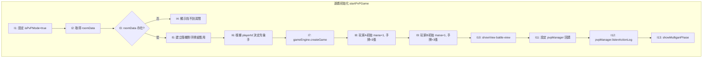
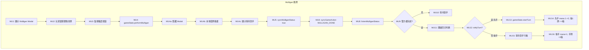
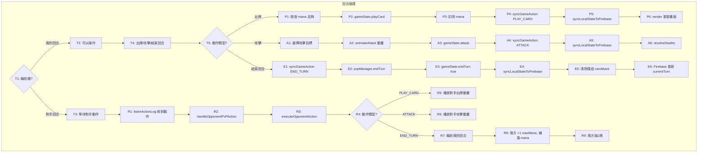

# PVP 對戰流程圖 - 完整詳細版

## 配對階段

```mermaid
flowchart TB
    subgraph MATCH["配對階段"]
        M1[M1: 玩家A點擊玩家對戰] --> M2[M2: 顯示配對Modal]
        M2 --> M3[M3: 設定 onMatchFound 回調]
        M3 --> M4[M4: 呼叫 joinMatchmaking]
        M4 --> M5[M5: 檢查是否已在佇列]
        M5 -->|已在佇列| M6[M6: 返回已在佇列]
        M5 -->|未在佇列| M7[M7: 寫入 matchmaking_queue/userId]
        M7 --> M8[M8: 設定 onDisconnect 自動移除]
        M8 --> M9[M9: 呼叫 _startMatchmakingListener]
        M9 --> M10[M10: 呼叫 tryMatchWithPlayer]
        M10 --> M11{M11: 有其他等待玩家?}
        M11 -->|否| M12[M12: 等待被配對]
        M11 -->|是| M13[M13: 呼叫 _createGameRoom]
        M13 --> M14[M14: 建立 game_rooms/roomId]
        M14 --> M15[M15: 更新雙方 status=matched]
        M15 --> M16[M16: _startMatchmakingListener 觸發]
        M16 --> M17[M17: await _joinGameRoom]
        M17 --> M17a[M17a: 等待 onValue 回傳房間資料]
        M17a --> M18[M18: 設定 currentRoom]
        M18 --> M19[M19: 觸發 onMatchFound 回調]
        M19 --> M20[M20: 呼叫 startPvPGame]
    end
```



## 遊戲初始化階段



## Mulligan 換牌階段



## 遊戲回合循環



## Firebase 資料結構

```
matchmaking_queue/
  └── {userId}/
      ├── userId: string
      ├── username: string
      ├── level: number
      ├── deckCards: string[]
      ├── status: "waiting" | "matched"
      ├── roomId: string (配對成功後)
      └── playerId: "player1" | "player2"

game_rooms/
  └── {roomId}/
      ├── status: "initializing" | "playing" | "finished"
      ├── players/
      │   ├── player1/
      │   │   ├── userId: string
      │   │   ├── connected: boolean
      │   │   └── lastPing: number
      │   └── player2/
      │       └── ...
      ├── gameState/
      │   ├── currentTurn: "player1" | "player2"
      │   ├── turnNumber: number
      │   ├── mulliganStatus/
      │   │   ├── player1: boolean
      │   │   └── player2: boolean
      │   ├── player1State/
      │   │   ├── hp: 30
      │   │   ├── mana: 1
      │   │   └── maxMana: 1
      │   └── player2State/
      │       └── ...
      └── actionLog/
          └── {actionId}/
              ├── action: "PLAY_CARD" | "ATTACK" | "END_TURN"
              ├── player: "player1" | "player2"
              ├── data: object
              └── timestamp: number
```
